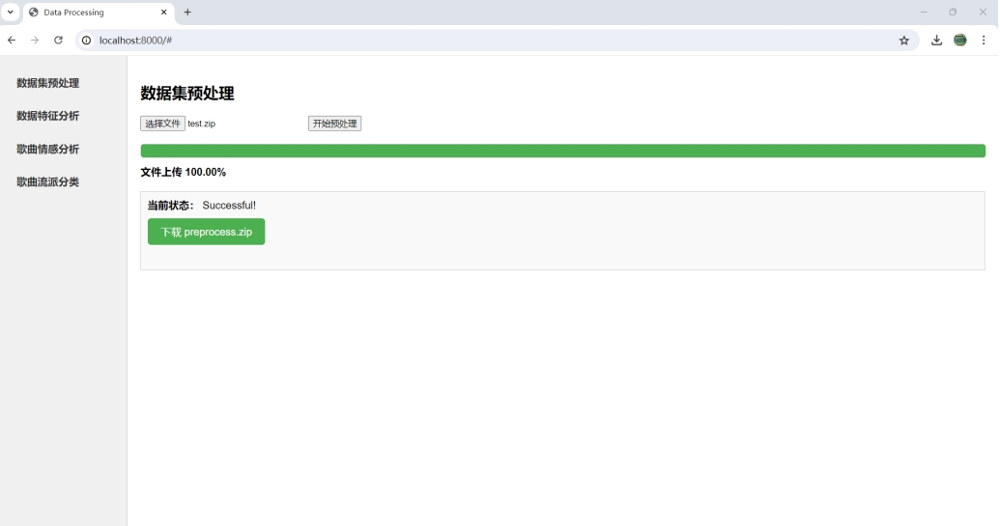
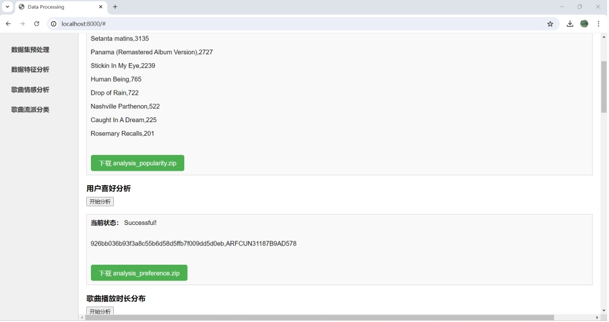
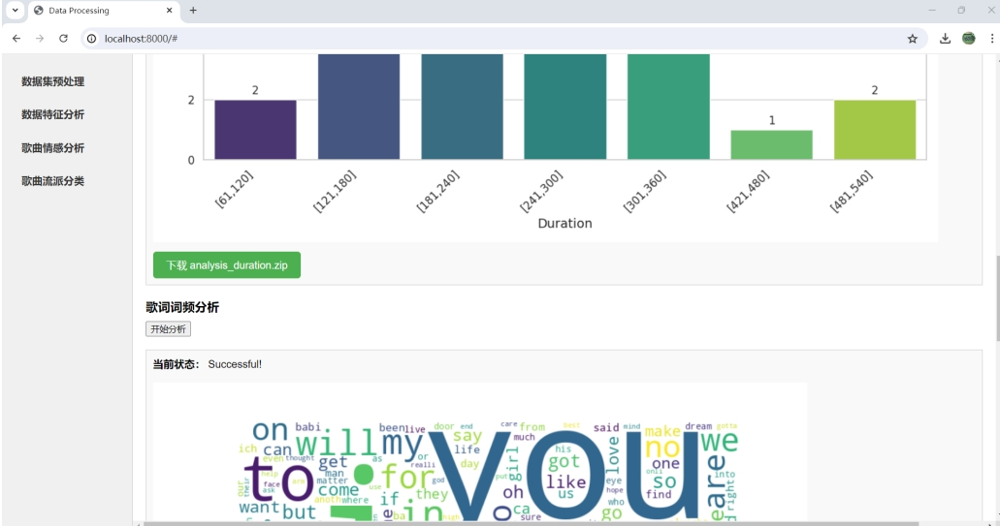
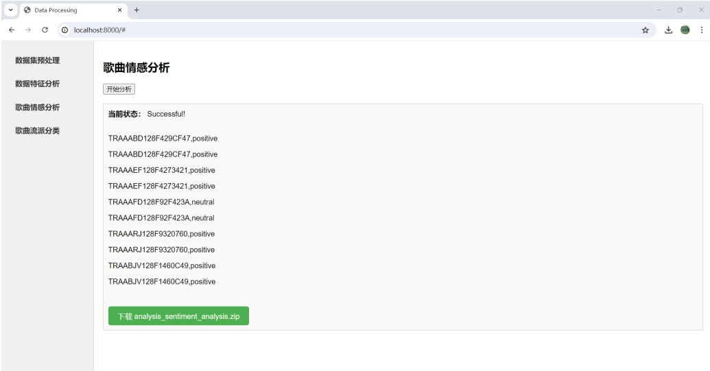
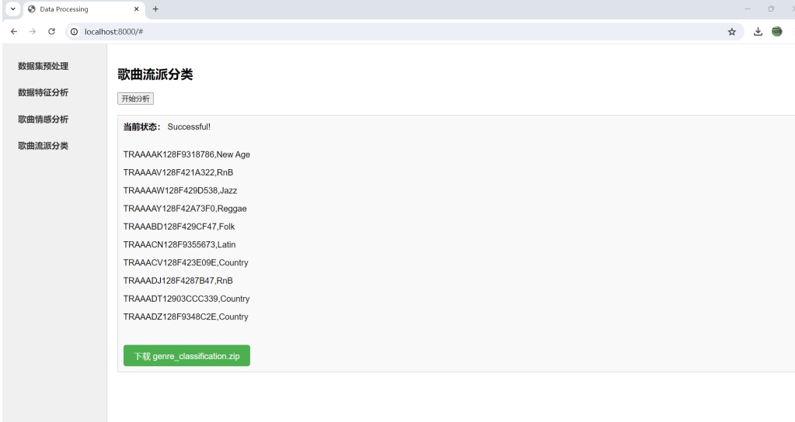

# Big Data Experiment - Sentiment and Genre Classifier

## Project Overview
This project encompasses various functionalities including data analysis, music genre classification, data preprocessing, and a sentiment analysis GUI.

## Features
- Utilized MapReduce to process large-scale music data, including preprocessing, data cleaning, and feature extraction.
- Developed sentiment prediction and genre classification based on TF-IDF calculation of lyrics using Bayes Classifier.
- Implemented a website interaction system separating backend calculations from the frontend GUI for user interaction.

## Directory Structure
```
- Analysis
- GenreClassification
- Preprocess
- Sentiment_gui
```

## Functionality of Each Module

### Analysis
This module is dedicated to data analysis, providing tools for data processing and visualization.

### GenreClassification
This module focuses on music genre classification using machine learning algorithms to categorize music.

### Preprocess
This module handles data preprocessing, including data cleaning and feature extraction.

### Sentiment_gui
This module offers a graphical user interface for sentiment analysis, allowing users to input text and receive sentiment analysis results.

## Contributing
Contributions are welcome! Please submit issues and pull requests.

## How to Compile and Run
To compile and run the Tower Defense game, follow these steps:

### Prerequisites

1. **Linux Operating System**
   - **Install Linux**: You can install a Linux OS like RHELS 7.0 directly or set up a Linux virtual machine on Windows.
   - **Install SSH**: Ensure SSH is installed for remote management of Hadoop nodes.

2. **Java**
   - **Download and Install Java**: For example, install Java in the `/usr/java` directory.
   - **Configure Environment Variables**:
     ```bash
     export JAVA_HOME=/usr/java/java-1.7
     export PATH=$JAVA_HOME/bin:$PATH
     ```

3. **Hadoop**
   - **Download and Install Hadoop**: Download the Hadoop package from the official website and extract it.
   - **Configure Environment Variables**:
     ```bash
     export HADOOP_HOME=/home/hadoop/hadoop_installs/hadoop-2.7.1
     export PATH=$HADOOP_HOME/bin:$PATH
     ```
   - **Configure SSH for Passwordless Access**:
     ```bash
     ssh-keygen -t rsa -P ""
     cat ~/.ssh/id_rsa.pub >> ~/.ssh/authorized_keys
     ```

4. **Flask**
   - **Install Flask**: Use pip to install Flask.
     ```bash
     pip install Flask
     ```
     
### Steps

1. **Clone the Repository**:
- Open a terminal and run:
  ```bash
    git clone https://github.com/yun-ni-2024/Sentiment-and-Genre-Classifier.git
    cd Sentiment-and-Genre-Classifier
  ```
  
2. **Navigate to the GUI Directory**:
   - Change to the `gui` directory:
     ```bash
     cd gui
     ```

3. **Run the Application**:
   - Execute the `app.py` file:
     ```bash
     python app.py
     ```

4. **Open the Web Application**:
   - Open your web browser and go to `http://localhost:8000`.

5. **Upload the Source Data Folder**:
   - Upload the compressed source data folder, which should include the `users`, `songs`, `lyrics`, and `genres` files.

6. **Interact with the Web Application**:
   - Click the button on the webpage to proceed with the desired actions.

## Effect Display

Here are some images to showcase the effects:






